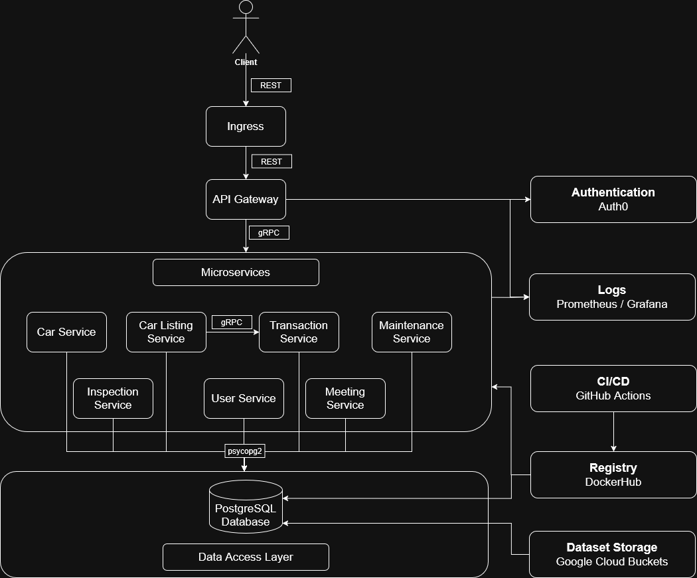

# StandFCOOL Car Dealership - Cloud Computing

**Authors:**
- Manuel Campos (fc58166)
- Guilherme Sousa (fc58170)
- Gabriel Henriques (fc58182)
- Tiago Almeida (fc58161)

**Grade:** 20/20

## Introduction

A cloud-native application designed to manage a modern car dealership platform, built using real-world car listing data from [Craigslist's cars and trucks dataset](https://www.kaggle.com/datasets/austinreese/craigslist-carstrucks-data). The system provides comprehensive functionality for managing car listings, user interactions, maintenance scheduling, inspections, and transactions in a distributed cloud environment. For detailed technical specifications and implementation details, please refer to our [comprehensive technical report](docs/standfcool_report.pdf).

The application leverages modern cloud-native technologies including Kubernetes for orchestration, gRPC for inter-service communication, and a robust monitoring stack with Prometheus and Grafana. The system's API is documented using [OpenAPI specifications](docs/openapi_standfcool.yaml), making it easy for third-party integrations.

## System Architecture
The system follows a microservices architecture, where each service manages a specific domain. The microservices communicate with each other using gRPC, while external clients interact with the system through a REST-based API Gateway.

### API Gateway
- Acts as the single entry point for all external requests, exposing a REST API.
- Receives HTTP REST requests and forwards them to appropriate microservices via gRPC
- Handles authentication and request validation using Auth0.
- Includes Prometheus metrics collection for monitoring.
- Provides a web interface with templates for user authentication and dashboard access.

### User, Car, Car Listing, Transaction, Maintenance, Inspection and Meeting Services
- Each Service manages the data of their own domain and provides CRUD operations to interact with them

### Database Layer
- Single PostgreSQL database shared among all microservices.
- Contains tables for cars, users, car_listings, transactions, maintenance, inspection, and meetings.
- Ensures referential integrity through foreign key constraints.
- Populated with sample data for testing and development.
- Database connection details are configured through environment variables.

### Monitoring
- All services include Prometheus metrics collection for monitoring.
- Grafana dashboards are available for metrics visualization.
- Metrics include request counts, latency histograms, active requests, and database operation time.

### Authentication and Authorization
- Integration with Auth0 for user authentication.
- Role-based access control with permissions for different operations.
- JWT tokens used for API authentication.
- Session management for web interface.

### CI/CD and Delivery
- GitHub Actions workflows automate the continuous integration and delivery pipeline.
- Automated builds, tests, and deployments are triggered by commits to the main branch
- Docker images are built for each microservice and pushed to DockerHub.

## How to run the project

1. Create in the project's root folder a `.env` file with the necessary credentials:

        DB_HOST=db-service
        DB_PORT=5432
        DB_NAME=CloudStand
        DB_USER=postgres
        DB_PASS=pass
        AUTH0_DOMAIN=<domain>
        AUTH0_CLIENT_ID=<client_id>
        AUTH0_CLIENT_SECRET=<client_secret>
        AUTH0_AUDIENCE=<audience>
        FLASK_SECRET_KEY=<flask_key>
        AUTH0_CALLBACK_URL=<http://ingress_ip/callback>

2. Create a Kubernetes Cluster and run `./apply_kubernetes_manifests.sh` to start the pods

    (May need to run `chmod +x` to make script executable)

3. Run `kubectl get ingress` to get the `ingress_ip`

    Change in the Auth0 the Ingress IP and then change in the `.env` the missing information

4. Run `./clean.sh` and rerun `./apply_kubernetes_manifests.sh`

5. Access the system directly via the Ingress IP or do requests with Postman

6. Access the monitoring interfaces via port-forwarding:

    - Prometheus: `kubectl port-forward service/prometheus-svc 8080:9090`

    - Grafana: `kubectl port-forward service/grafana-svc 8080:3000`

        There's two already made [dashboards](grafana-dashboards) that can be imported, just need to change datasource's uid in the json